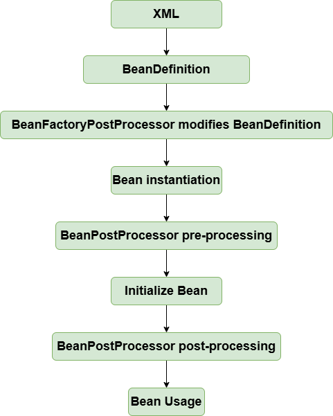
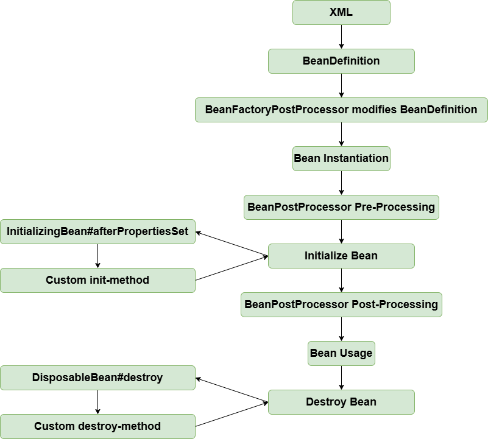
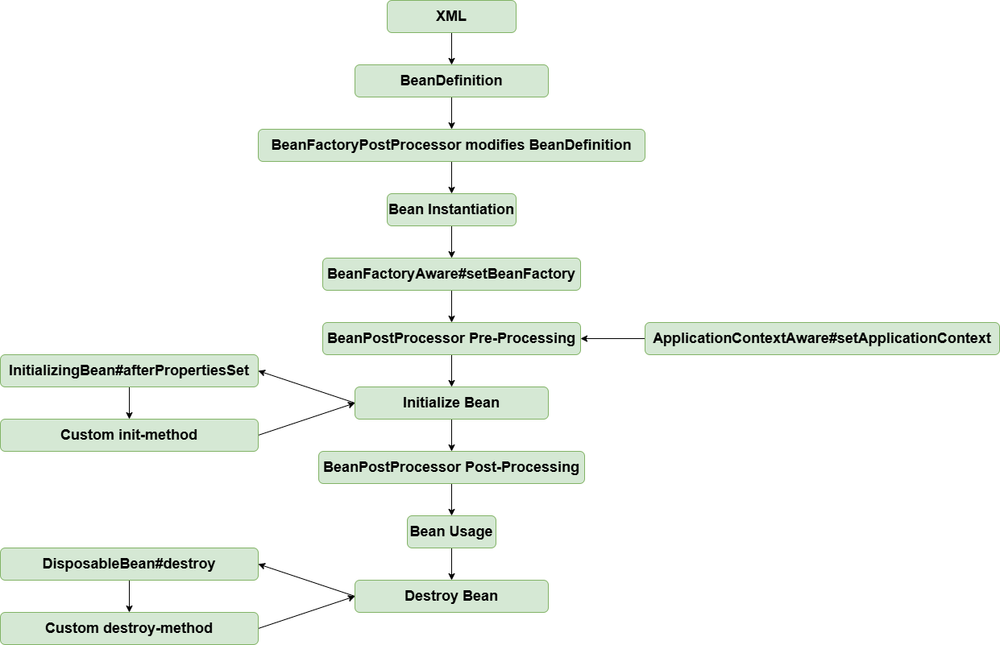
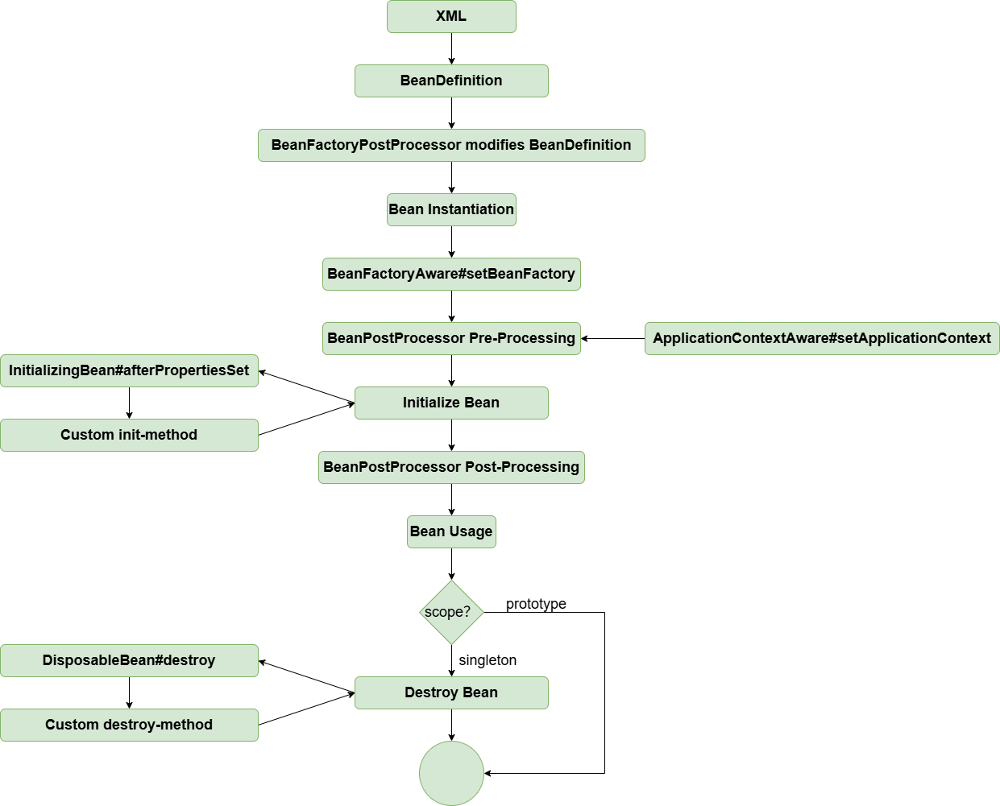
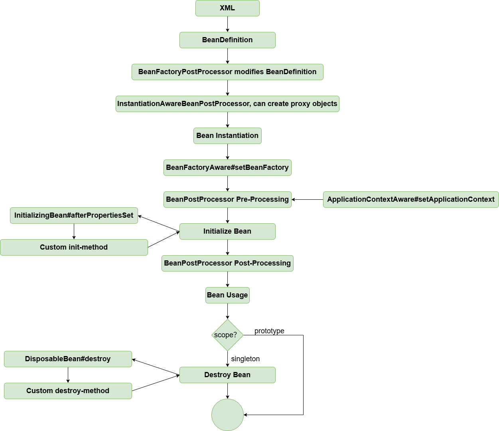
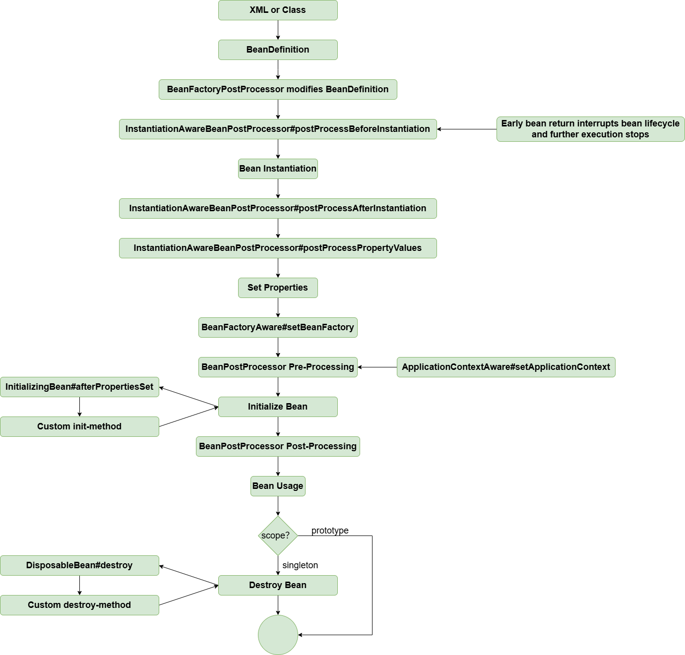

# [Basics: IoC](#basics-ioc)
 ## [Simple Bean Container](#simple-bean-container)
 > Code branch：simple-bean-container

Define a simple BeanFactory that uses a Map to store beans, providing methods for bean registration and retrieval
```java
public class BeanFactory {
	private Map<String, Object> beanMap = new HashMap<>();

	public void registerBean(String name, Object bean) {
		beanMap.put(name, bean);
	}

	public Object getBean(String name) {
		return beanMap.get(name);
	}
}
```

**Test:**
```java
public class SimpleBeanContainerTest {

	@Test
	public void testGetBean() throws Exception {
		BeanFactory beanFactory = new BeanFactory();
		beanFactory.registerBean("helloService", new HelloService());
		HelloService helloService = (HelloService) beanFactory.getBean("helloService");
		assertThat(helloService).isNotNull();
		assertThat(helloService.sayHello()).isEqualTo("hello");
	}

	class HelloService {
		public String sayHello() {
			System.out.println("hello");
			return "hello";
		}
	}
}
```

## [BeanDefinition and BeanDefinitionRegistry](#beandefinition-and-beandefinitionregistry)
> Code branch: bean-definition-and-bean-definition-registry

New classes added:
- `BeanDefinition`: Defines the bean metadata such as class type, constructor arguments, and property values. For simplicity, this version only contains the class type.
- `BeanDefinitionRegistry`: Interface for registering `BeanDefinition` instances.
- `SingletonBeanRegistry` and its implementation `DefaultSingletonBeanRegistry`: Defines methods for adding and retrieving singleton beans.

The bean container implements both `BeanDefinitionRegistry` and `SingletonBeanRegistry`, giving it the ability to register `BeanDefinition` and manage singleton beans. Beans are only instantiated when they are used.


**Test:**
```java
public class BeanDefinitionAndBeanDefinitionRegistryTest {

	@Test
	public void testBeanFactory() throws Exception {
		DefaultListableBeanFactory beanFactory = new DefaultListableBeanFactory();
		BeanDefinition beanDefinition = new BeanDefinition(HelloService.class);
		beanFactory.registerBeanDefinition("helloService", beanDefinition);

		HelloService helloService = (HelloService) beanFactory.getBean("helloService");
		helloService.sayHello();
	}
}

class HelloService {
	public String sayHello() {
		System.out.println("hello");
		return "hello";
	}
}
```

## [Bean Instantiation Strategy](#bean-instantiation-strategy)
> Code branch: `instantiation-strategy`

Currently, beans are instantiated using `beanClass.newInstance()` in `AbstractAutowireCapableBeanFactory.doCreateBean`, which only works for no-argument constructors.


To provide more flexible bean instantiation, an `InstantiationStrategy` interface is introduced, with two implementations:
- `SimpleInstantiationStrategy`: Uses constructors to instantiate beans.
- `CglibSubclassingInstantiationStrategy`: Uses CGLIB to generate subclass proxies.

## [Populating Bean Properties](#populating-bean-properties)
> Code branch: `populate-bean-with-property-values`

- `BeanDefinition` now includes `PropertyValues` to store bean properties.
- After instantiating a bean, properties are set via `AbstractAutowireCapableBeanFactory#applyPropertyValues`.

**Test:**
```java
public class PopulateBeanWithPropertyValuesTest {

	@Test
	public void testPopulateBeanWithPropertyValues() throws Exception {
		DefaultListableBeanFactory beanFactory = new DefaultListableBeanFactory();
		PropertyValues propertyValues = new PropertyValues();
		propertyValues.addPropertyValue(new PropertyValue("name", "derek"));
		propertyValues.addPropertyValue(new PropertyValue("age", 18));
		BeanDefinition beanDefinition = new BeanDefinition(Person.class, propertyValues);
		beanFactory.registerBeanDefinition("person", beanDefinition);

		Person person = (Person) beanFactory.getBean("person");
		System.out.println(person);
		assertThat(person.getName()).isEqualTo("derek");
		assertThat(person.getAge()).isEqualTo(18);
	}
}
```

## [Injecting a Bean into Another Bean](#injecting-a-bean-into-another-bean)
> Branch: `populate-bean-with-bean`

Added `BeanReference` to represent a bean's dependency on another bean. When instantiating `beanA`, if a property value is a `BeanReference` pointing to `beanB`, `beanB` is instantiated first.

To keep the implementation simple, circular dependencies are **not** supported for now. This will be handled in an advanced section later.

```java
protected void applyPropertyValues(String beanName, Object bean, BeanDefinition beanDefinition) {
    try {
        for (PropertyValue propertyValue : beanDefinition.getPropertyValues().getPropertyValues()) {
            String name = propertyValue.getName();
            Object value = propertyValue.getValue();
            if (value instanceof BeanReference) {
                // If beanA depends on beanB, instantiate beanB first
                BeanReference beanReference = (BeanReference) value;
                value = getBean(beanReference.getBeanName());
            }

            // Set property via reflection
            BeanUtil.setFieldValue(bean, name, value);
        }
    } catch (Exception ex) {
        throw new BeansException("Error setting property values for bean: " + beanName, ex);
    }
}
```

**Test:**
```java
public class PopulateBeanWithPropertyValuesTest {

	/**
	 * Injecting a Bean into Another Bean
	 *
	 * @throws Exception
	 */
	@Test
	public void testPopulateBeanWithBean() throws Exception {
		DefaultListableBeanFactory beanFactory = new DefaultListableBeanFactory();

		// Register Car instance
		PropertyValues propertyValuesForCar = new PropertyValues();
		propertyValuesForCar.addPropertyValue(new PropertyValue("brand", "porsche"));
		BeanDefinition carBeanDefinition = new BeanDefinition(Car.class, propertyValuesForCar);
		beanFactory.registerBeanDefinition("car", carBeanDefinition);

		// Register Person instance
		PropertyValues propertyValuesForPerson = new PropertyValues();
		propertyValuesForPerson.addPropertyValue(new PropertyValue("name", "derek"));
		propertyValuesForPerson.addPropertyValue(new PropertyValue("age", 18));
		// Person depends on Car instance
		propertyValuesForPerson.addPropertyValue(new PropertyValue("car", new BeanReference("car")));
		BeanDefinition beanDefinition = new BeanDefinition(Person.class, propertyValuesForPerson);
		beanFactory.registerBeanDefinition("person", beanDefinition);

		Person person = (Person) beanFactory.getBean("person");
		System.out.println(person);
		assertThat(person.getName()).isEqualTo("derek");
		assertThat(person.getAge()).isEqualTo(18);
		Car car = person.getCar();
		assertThat(car).isNotNull();
		assertThat(car.getBrand()).isEqualTo("porsche");
	}
}
```

## [Resources and Resource Loaders](#resources-and-resource-loaders)
> Code branch: `resource-and-resource-loader`

`Resource` is an abstraction for resources and provides an access interface. Three implementations are created:


- `FileSystemResource`: Implementation for file system resources.
- `ClassPathResource`: Implementation for classpath resources.
- `UrlResource`: Implementation for resources located via `java.net.URL`.

`ResourceLoader` is an abstraction for resource lookup strategies, with `DefaultResourceLoader` as the default implementation.

**Test:**
```java
public class ResourceAndResourceLoaderTest {

	@Test
	public void testResourceLoader() throws Exception {
		DefaultResourceLoader resourceLoader = new DefaultResourceLoader();

		// Load classpath resource
		Resource resource = resourceLoader.getResource("classpath:hello.txt");
		InputStream inputStream = resource.getInputStream();
		String content = IoUtil.readUtf8(inputStream);
		System.out.println(content);
		assertThat(content).isEqualTo("hello world");

		// Load file system resource
		resource = resourceLoader.getResource("src/test/resources/hello.txt");
		assertThat(resource instanceof FileSystemResource).isTrue();
		inputStream = resource.getInputStream();
		content = IoUtil.readUtf8(inputStream);
		System.out.println(content);
		assertThat(content).isEqualTo("hello world");

		// Load URL resource
		resource = resourceLoader.getResource("https://www.baidu.com");
		assertThat(resource instanceof UrlResource).isTrue();
		inputStream = resource.getInputStream();
		content = IoUtil.readUtf8(inputStream);
		System.out.println(content);
	}
}
```

## [Defining Beans in XML](#defining-beans-in-xml)
> Code branch: `xml-file-define-bean`

With the `ResourceLoader`, we can declaratively define bean information in XML configuration files. The resource loader reads the XML file, parses the bean information, and registers the `BeanDefinition` into the container.

`BeanDefinitionReader` is an abstraction for reading bean definition information, and `XmlBeanDefinitionReader` is the implementation for reading from XML files. The `BeanDefinitionReader` needs the ability to access resources, and after reading the bean definitions, it registers them into the container. Thus, the abstract implementation `AbstractBeanDefinitionReader` has both `ResourceLoader` and `BeanDefinitionRegistry` properties.

Since content read from the XML file is a `String`, only properties of type `String` or references to other beans are supported. Type converters for type conversion will be covered later.

To align with Spring's `BeanFactory` inheritance structure, slight adjustments were made to the inheritance hierarchy for `BeanFactory`.


**Test:**  
Bean definition file `spring.xml`
```xml
<?xml version="1.0" encoding="UTF-8"?>
<beans xmlns="http://www.springframework.org/schema/beans"
       xmlns:xsi="http://www.w3.org/2001/XMLSchema-instance"
       xmlns:context="http://www.springframework.org/schema/context"
       xsi:schemaLocation="http://www.springframework.org/schema/beans
	         http://www.springframework.org/schema/beans/spring-beans.xsd
		 http://www.springframework.org/schema/context
		 http://www.springframework.org/schema/context/spring-context-4.0.xsd">

    <bean id="person" class="org.springframework.test.bean.Person">
        <property name="name" value="derek"/>
        <property name="car" ref="car"/>
    </bean>

    <bean id="car" class="org.springframework.test.bean.Car">
        <property name="brand" value="porsche"/>
    </bean>

</beans>
```

```java
public class XmlFileDefineBeanTest {

	@Test
	public void testXmlFile() throws Exception {
		DefaultListableBeanFactory beanFactory = new DefaultListableBeanFactory();
		XmlBeanDefinitionReader beanDefinitionReader = new XmlBeanDefinitionReader(beanFactory);
		beanDefinitionReader.loadBeanDefinitions("classpath:spring.xml");

		Person person = (Person) beanFactory.getBean("person");
		System.out.println(person);
		assertThat(person.getName()).isEqualTo("derek");
		assertThat(person.getCar().getBrand()).isEqualTo("porsche");

		Car car = (Car) beanFactory.getBean("car");
		System.out.println(car);
		assertThat(car.getBrand()).isEqualTo("porsche");
	}
}
```

## [BeanFactoryPostProcessor & BeanPostProcessor](#bean-factory-post-processor-and-bean-post-processor)
> Code branch: `bean-factory-post-processor-and-bean-post-processor`

`BeanFactoryPostProcessor` and `BeanPostProcessor` are two heavyweight interfaces in the Spring framework. Understanding the role of these interfaces provides a solid grasp of the core principles of Spring. To make it easier to understand, they are implemented in two sections.

`BeanFactoryPostProcessor` is a container extension mechanism in Spring that allows modification of bean definition information (i.e., `BeanDefinition`) before bean instantiation. Key implementations include `PropertyPlaceholderConfigurer` and `CustomEditorConfigurer`. The role of `PropertyPlaceholderConfigurer` is to replace placeholders in XML files with values from properties files, while `CustomEditorConfigurer` handles type conversion. The implementation of `BeanFactoryPostProcessor` is straightforward; refer to the unit test `BeanFactoryPostProcessorAndBeanPostProcessorTest#testBeanFactoryPostProcessor` for more details.

`BeanPostProcessor` is also a container extension mechanism provided by Spring. Unlike `BeanFactoryPostProcessor`, `BeanPostProcessor` modifies or replaces beans **after** bean instantiation. It plays a critical role in AOP implementation.

The two methods of `BeanPostProcessor` are executed before and after the bean's initialization method (which will be discussed later). Key implementations can be found in the unit test `BeanFactoryPostProcessorAndBeanPostProcessorTest#testBeanPostProcessor` and the method `AbstractAutowireCapableBeanFactory#initializeBean`. Some minor adjustments have been made, but these can be ignored for now.

```java
public interface BeanPostProcessor {
	/**
	 * Executed before the bean's initialization method
	 */
	Object postProcessBeforeInitialization(Object bean, String beanName) throws BeansException;

	/**
	 * Executed after the bean's initialization method
	 */
	Object postProcessAfterInitialization(Object bean, String beanName) throws BeansException;
}
```

Next section introduces `ApplicationContext`, which can automatically detect `BeanFactoryPostProcessor` and `BeanPostProcessor`. These can be configured in the XML file without manually adding them to the `BeanFactory`.

**Test:**
```java
public class BeanFactoryProcessorAndBeanPostProcessorTest {

	@Test
	public void testBeanFactoryPostProcessor() throws Exception {
		DefaultListableBeanFactory beanFactory = new DefaultListableBeanFactory();
		XmlBeanDefinitionReader beanDefinitionReader = new XmlBeanDefinitionReader(beanFactory);
		beanDefinitionReader.loadBeanDefinitions("classpath:spring.xml");

		// Modify BeanDefinition properties before bean instantiation
		CustomBeanFactoryPostProcessor beanFactoryPostProcessor = new CustomBeanFactoryPostProcessor();
		beanFactoryPostProcessor.postProcessBeanFactory(beanFactory);

		Person person = (Person) beanFactory.getBean("person");
		System.out.println(person);
		// Name changed to ivy in CustomBeanFactoryPostProcessor
		assertThat(person.getName()).isEqualTo("ivy");
	}

	@Test
	public void testBeanPostProcessor() throws Exception {
		DefaultListableBeanFactory beanFactory = new DefaultListableBeanFactory();
		XmlBeanDefinitionReader beanDefinitionReader = new XmlBeanDefinitionReader(beanFactory);
		beanDefinitionReader.loadBeanDefinitions("classpath:spring.xml");

		// Add BeanPostProcessor to modify bean properties after instantiation
		CustomerBeanPostProcessor customerBeanPostProcessor = new CustomerBeanPostProcessor();
		beanFactory.addBeanPostProcessor(customerBeanPostProcessor);

		Car car = (Car) beanFactory.getBean("car");
		System.out.println(car);
		// Brand changed to lamborghini in CustomerBeanPostProcessor
		assertThat(car.getBrand()).isEqualTo("lamborghini");
	}
}
```

## [ApplicationContext](#applicationcontext)
> Branch: `application-context`

`ApplicationContext` is an advanced IOC container in Spring, compared to `BeanFactory`. In addition to all the features of `BeanFactory`, it also supports:
- Automatic detection of special beans like `BeanFactoryPostProcessor` and `BeanPostProcessor` (as discussed in the previous section)
- Resource loading
- Container events and listeners
- Internationalization support
- Automatic initialization of singleton beans

While `BeanFactory` is the infrastructure for Spring, `ApplicationContext` is designed for users of Spring applications.

For the implementation details, check the `AbstractApplicationContext#refresh` method. Note that `BeanFactoryPostProcessor` and `BeanPostProcessor` are automatically recognized, so you no longer need to manually add them to the container in the XML file as shown earlier.

The bean lifecycle looks like this:



**Test:** See `ApplicationContextTest`

## [Bean Initialization and Destruction Methods](#bean-initialization-and-destruction-methods)
> Branch: `init-and-destroy-method`

In Spring, there are three ways to define initialization and destruction methods for beans:
- Specify `init-method` and `destroy-method` in the XML configuration
- Implement `InitializingBean` and `DisposableBean` interfaces
- Use `@PostConstruct` and `@PreDestroy` annotations

The third method is implemented via `BeanPostProcessor` and will be covered in the advanced section. This section only covers the first two methods.

For the first method (XML configuration), `initMethodName` and `destroyMethodName` properties are added to `BeanDefinition`.

The initialization method is executed in `AbstractAutowireCapableBeanFactory#invokeInitMethods`. Beans with destruction methods are registered in `disposableBeans` in `DefaultSingletonBeanRegistry`, and are registered for destruction in `AbstractAutowireCapableBeanFactory#registerDisposableBeanIfNecessary`.

To ensure destruction methods run before the VM shuts down, a shutdown hook is registered in the JVM via `AbstractApplicationContext#registerShutdownHook` (this must be manually called in non-web applications). Alternatively, you can call `ApplicationContext#close` to close the container.

At this point, the bean lifecycle looks like this:



**Test:** 
<br> init-and-destroy-method.xml
```xml
<?xml version="1.0" encoding="UTF-8"?>
<beans xmlns="http://www.springframework.org/schema/beans"
       xmlns:xsi="http://www.w3.org/2001/XMLSchema-instance"
       xmlns:context="http://www.springframework.org/schema/context"
       xsi:schemaLocation="http://www.springframework.org/schema/beans
	         http://www.springframework.org/schema/beans/spring-beans.xsd
		 http://www.springframework.org/schema/context
		 http://www.springframework.org/schema/context/spring-context-4.0.xsd">

    <bean id="person" class="org.springframework.test.bean.Person" init-method="customInitMethod" destroy-method="customDestroyMethod">
        <property name="name" value="derek"/>
        <property name="car" ref="car"/>
    </bean>

    <bean id="car" class="org.springframework.test.bean.Car">
        <property name="brand" value="porsche"/>
    </bean>

</beans>
```

```java
public class Person implements InitializingBean, DisposableBean {

	private String name;

	private int age;

	private Car car;

	public void customInitMethod() {
		System.out.println("I was born in the method named customInitMethod");
	}

	public void customDestroyMethod() {
		System.out.println("I died in the method named customDestroyMethod");
	}

	@Override
	public void afterPropertiesSet() throws Exception {
		System.out.println("I was born in the method named afterPropertiesSet");
	}

	@Override
	public void destroy() throws Exception {
		System.out.println("I died in the method named destroy");
	}

    //setter and getter
}
```

```java
public class InitAndDestoryMethodTest {

	@Test
	public void testInitAndDestroyMethod() throws Exception {
		ClassPathXmlApplicationContext applicationContext = new ClassPathXmlApplicationContext("classpath:init-and-destroy-method.xml");
		applicationContext.registerShutdownHook();  // Alternatively, manually close using applicationContext.close();
	}
}
```

## [Aware Interface](#aware-interface)
> Branch: `aware-interface`

`Aware` refers to awareness. The `Aware` interface is a marker interface that allows implementing classes to be aware of container-related objects. Common `Aware` interfaces include `BeanFactoryAware` and `ApplicationContextAware`, which allow classes to be aware of their `BeanFactory` and `ApplicationContext`, respectively.

To make a class aware of its `BeanFactory`, it implements the `BeanFactoryAware` interface. This is done easily in `AbstractAutowireCapableBeanFactory#initializeBean` (the first three lines).

To make a class aware of its `ApplicationContext`, the `ApplicationContextAware` interface is used via a `BeanPostProcessor`. After the bean is instantiated, it goes through the pre- and post-processing steps of `BeanPostProcessor`. We define a `BeanPostProcessor` implementation called `ApplicationContextAwareProcessor`, which is added to the `BeanFactory` in the `AbstractApplicationContext#refresh` method. The pre-processing step sets the `ApplicationContext` for the bean.

We now use `dom4j` to parse the XML file.

At this point, the bean lifecycle looks like this:



**Test:** 
<br> spring.xml
```xml
<?xml version="1.0" encoding="UTF-8"?>
<beans xmlns="http://www.springframework.org/schema/beans"
       xmlns:xsi="http://www.w3.org/2001/XMLSchema-instance"
       xmlns:context="http://www.springframework.org/schema/context"
       xsi:schemaLocation="http://www.springframework.org/schema/beans
	         http://www.springframework.org/schema/beans/spring-beans.xsd
		 http://www.springframework.org/schema/context
		 http://www.springframework.org/schema/context/spring-context-4.0.xsd">

    <bean id="helloService" class="org.springframework.test.service.HelloService"/>

</beans>
```

```java
public class HelloService implements ApplicationContextAware, BeanFactoryAware {

	private ApplicationContext applicationContext;

	private BeanFactory beanFactory;

	@Override
	public void setBeanFactory(BeanFactory beanFactory) throws BeansException {
		this.beanFactory = beanFactory;
	}

	@Override
	public void setApplicationContext(ApplicationContext applicationContext) throws BeansException {
		this.applicationContext = applicationContext;
	}

	public ApplicationContext getApplicationContext() {
		return applicationContext;
	}

	public BeanFactory getBeanFactory() {
		return beanFactory;
	}
}
```

```java
public class AwareInterfaceTest {

	@Test
	public void test() throws Exception {
		ClassPathXmlApplicationContext applicationContext = new ClassPathXmlApplicationContext("classpath:spring.xml");
		HelloService helloService = applicationContext.getBean("helloService", HelloService.class);
		assertThat(helloService.getApplicationContext()).isNotNull();
		assertThat(helloService.getBeanFactory()).isNotNull();
	}
}
```

## [Bean Scope - Adding Prototype Support](#bean-scope-adding-prototype-support)
> Branch: `prototype-bean`

For a `prototype` scoped bean, every time it's requested from the container, a new instance is created. We add a `scope` field in `BeanDefinition` to describe the bean's scope. When creating a prototype bean (`AbstractAutowireCapableBeanFactory#doCreateBean`), it is **not** added to the `singletonObjects` map. 

Prototype beans do not execute their destruction methods, as seen in `AbstractAutowireCapableBeanFactory#registerDisposableBeanIfNecessary`.

At this point, the bean lifecycle looks like this:



**Test:** 
<br> prototype-bean.xml
```xml
<?xml version="1.0" encoding="UTF-8"?>
<beans xmlns="http://www.springframework.org/schema/beans"
       xmlns:xsi="http://www.w3.org/2001/XMLSchema-instance"
       xmlns:context="http://www.springframework.org/schema/context"
       xsi:schemaLocation="http://www.springframework.org/schema/beans
	         http://www.springframework.org/schema/beans/spring-beans.xsd
		 http://www.springframework.org/schema/context
		 http://www.springframework.org/schema/context/spring-context-4.0.xsd">

    <bean id="car" class="org.springframework.test.bean.Car" scope="prototype">
        <property name="brand" value="porsche"/>
    </bean>

</beans>
```

```java
public class PrototypeBeanTest {

	@Test
	public void testPrototype() throws Exception {
		ClassPathXmlApplicationContext applicationContext = new ClassPathXmlApplicationContext("classpath:prototype-bean.xml");

		Car car1 = applicationContext.getBean("car", Car.class);
		Car car2 = applicationContext.getBean("car", Car.class);
		assertThat(car1 != car2).isTrue();
	}
}
```

## [FactoryBean](#FactoryBean)
> Branch: `factory-bean`

`FactoryBean` is a special type of bean. When this bean is requested from the container, the container doesn't return the bean itself but instead returns the value from the `FactoryBean#getObject` method. This allows complex beans to be defined programmatically.

The logic is simple: when the container detects that a bean is of type `FactoryBean`, it calls its `getObject` method to return the actual bean. If `FactoryBean#isSingleton` is `true`, the resulting bean is cached and reused on subsequent requests. See changes in `AbstractBeanFactory#getBean`.

**Test:** 
<br> factory-bean.xml
```xml
<?xml version="1.0" encoding="UTF-8"?>
<beans xmlns="http://www.springframework.org/schema/beans"
       xmlns:xsi="http://www.w3.org/2001/XMLSchema-instance"
       xmlns:context="http://www.springframework.org/schema/context"
       xsi:schemaLocation="http://www.springframework.org/schema/beans
	         http://www.springframework.org/schema/beans/spring-beans.xsd
		 http://www.springframework.org/schema/context
		 http://www.springframework.org/schema/context/spring-context-4.0.xsd">

    <bean id="car" class="org.springframework.test.common.CarFactoryBean">
        <property name="brand" value="porsche"/>
    </bean>

</beans>
```

```java
public class CarFactoryBean implements FactoryBean<Car> {

	private String brand;

	@Override
	public Car getObject() throws Exception {
		Car car = new Car();
		car.setBrand(brand);
		return car;
	}

	@Override
	public boolean isSingleton() {
		return true;
	}

	public void setBrand(String brand) {
		this.brand = brand;
	}
}
```

```java
public class FactoryBeanTest {

	@Test
	public void testFactoryBean() throws Exception {
		ClassPathXmlApplicationContext applicationContext = new ClassPathXmlApplicationContext("classpath:factory-bean.xml");

		Car car = applicationContext.getBean("car", Car.class);
		applicationContext.getBean("car");
		assertThat(car.getBrand()).isEqualTo("porsche");
	}
}
```

## [Container Events and Event Listeners](#container-events-and-event-listeners)
> Branch: `event-and-event-listener`

The `ApplicationContext` container provides comprehensive event publishing and listener functionality.

The `ApplicationEventMulticaster` interface is the abstract interface for registering listeners and publishing events. `AbstractApplicationContext` contains an instance of its implementation, giving the `ApplicationContext` container the ability to register listeners and publish events. In the `AbstractApplicationContext#refresh` method, `ApplicationEventMulticaster` is instantiated, listeners are registered, and the container refresh event (`ContextRefreshedEvent`) is published. In the `AbstractApplicationContext#doClose` method, the container close event (`ContextClosedEvent`) is published.

**Test:**
<br> event-and-event-listener.xml
```xml
<?xml version="1.0" encoding="UTF-8"?>
<beans xmlns="http://www.springframework.org/schema/beans"
       xmlns:xsi="http://www.w3.org/2001/XMLSchema-instance"
       xmlns:context="http://www.springframework.org/schema/context"
       xsi:schemaLocation="http://www.springframework.org/schema/beans
	         http://www.springframework.org/schema/beans/spring-beans.xsd
		 http://www.springframework.org/schema/context
		 http://www.springframework.org/schema/context/spring-context-4.0.xsd">

    <bean class="org.springframework.test.common.event.ContextRefreshedEventListener"/>

    <bean class="org.springframework.test.common.event.CustomEventListener"/>

    <bean class="org.springframework.test.common.event.ContextClosedEventListener"/>
</beans>
```

```java
public class EventAndEventListenerTest {

	@Test
	public void testEventListener() throws Exception {
		ClassPathXmlApplicationContext applicationContext = new ClassPathXmlApplicationContext("classpath:event-and-event-listener.xml");
		applicationContext.publishEvent(new CustomEvent(applicationContext));

		applicationContext.registerShutdownHook(); // Or use applicationContext.close() to manually close the container
	}
}
```

Observe Output：
```
org.springframework.test.common.event.ContextRefreshedEventListener
org.springframework.test.common.event.CustomEventListener
org.springframework.test.common.event.ContextClosedEventListener
```

# [Basics: AOP](#basics-aop)

## [Pointcut Expression](#pointcut-expression)
> Branch: `pointcut-expression`

A **Joinpoint** is a specific method in a class where proxy operations need to be executed (only method-level JoinPoint is supported). A **Pointcut** defines the expression that captures the JoinPoint.

The most commonly used pointcut expression is AspectJ’s pointcut expression. To match a class, define the `ClassFilter` interface; to match a method, define the `MethodMatcher` interface. A **Pointcut** needs to match both the class and the method, and includes both `ClassFilter` and `MethodMatcher`. `AspectJExpressionPointcut` is an implementation of a Pointcut that supports AspectJ expressions, with a simple implementation that supports only the `execution` function.

**Test:**
```java
public class HelloService {
	public String sayHello() {
		System.out.println("hello");
		return "hello";
	}
}
```

```java
public class PointcutExpressionTest {

	@Test
	public void testPointcutExpression() throws Exception {
		AspectJExpressionPointcut pointcut = new AspectJExpressionPointcut("execution(* org.springframework.test.service.HelloService.*(..))");
		Class<HelloService> clazz = HelloService.class;
		Method method = clazz.getDeclaredMethod("sayHello");

		assertThat(pointcut.matches(clazz)).isTrue();
		assertThat(pointcut.matches(method, clazz)).isTrue();
	}
}
```

## [JDK-Based Dynamic Proxy](#jdk-based-dynamic-proxy)
> Branch: `jdk-dynamic-proxy`

`AopProxy` is the abstract interface for obtaining proxy objects, and `JdkDynamicAopProxy` is the concrete implementation based on JDK dynamic proxies. `TargetSource` is the wrapper for the target object being proxied. `MethodInterceptor` is the method interceptor, a key concept from AOP Alliance. As the name suggests, it intercepts methods and can add proxy behavior before or after the method is executed.

**Test**
```java
public class DynamicProxyTest {

	@Test
	public void testJdkDynamicProxy() throws Exception {
		WorldService worldService = new WorldServiceImpl();

		AdvisedSupport advisedSupport = new AdvisedSupport();
		TargetSource targetSource = new TargetSource(worldService);
		WorldServiceInterceptor methodInterceptor = new WorldServiceInterceptor();
		MethodMatcher methodMatcher = new AspectJExpressionPointcut("execution(* org.springframework.test.service.WorldService.explode(..))").getMethodMatcher();
		advisedSupport.setTargetSource(targetSource);
		advisedSupport.setMethodInterceptor(methodInterceptor);
		advisedSupport.setMethodMatcher(methodMatcher);

		WorldService proxy = (WorldService) new JdkDynamicAopProxy(advisedSupport).getProxy();
		proxy.explode();
	}
}
```

## [CGLIB-Based Dynamic Proxy](#cglib-based-dynamic-proxy)
> Branch: `cglib-dynamic-proxy`

The logic behind CGLIB-based dynamic proxy is simple, as seen in `CglibAopProxy`. Unlike JDK dynamic proxies, which generate proxy objects for interfaces at runtime, CGLIB dynamic proxies generate subclass bytecode files at runtime. This means that the target class does not need to implement any interface.

**Test:**
```java
public class DynamicProxyTest {

	private AdvisedSupport advisedSupport;

	@Before
	public void setup() {
		WorldService worldService = new WorldServiceImpl();

		advisedSupport = new AdvisedSupport();
		TargetSource targetSource = new TargetSource(worldService);
		WorldServiceInterceptor methodInterceptor = new WorldServiceInterceptor();
		MethodMatcher methodMatcher = new AspectJExpressionPointcut("execution(* org.springframework.test.service.WorldService.explode(..))").getMethodMatcher();
		advisedSupport.setTargetSource(targetSource);
		advisedSupport.setMethodInterceptor(methodInterceptor);
		advisedSupport.setMethodMatcher(methodMatcher);
	}

	@Test
	public void testCglibDynamicProxy() throws Exception {
		WorldService proxy = (WorldService) new CglibAopProxy(advisedSupport).getProxy();
		proxy.explode();
	}
}
```

## [AOP Proxy Factory](#aop-proxy-factory)
> Branch: `proxy-factory`

Added `ProxyFactory` for AOP proxies, which decides between JDK dynamic proxy or CGLIB dynamic proxy based on the `AdvisedSupport#proxyTargetClass` property.

**Test:**
```java
public class DynamicProxyTest {

	private AdvisedSupport advisedSupport;

	@Before
	public void setup() {
		WorldService worldService = new WorldServiceImpl();

		advisedSupport = new AdvisedSupport();
		TargetSource targetSource = new TargetSource(worldService);
		WorldServiceInterceptor methodInterceptor = new WorldServiceInterceptor();
		MethodMatcher methodMatcher = new AspectJExpressionPointcut("execution(* org.springframework.test.service.WorldService.explode(..))").getMethodMatcher();
		advisedSupport.setTargetSource(targetSource);
		advisedSupport.setMethodInterceptor(methodInterceptor);
		advisedSupport.setMethodMatcher(methodMatcher);
	}

	@Test
	public void testProxyFactory() throws Exception {
		// Use JDK dynamic proxy
		advisedSupport.setProxyTargetClass(false);
		WorldService proxy = (WorldService) new ProxyFactory(advisedSupport).getProxy();
		proxy.explode();

		// Use CGLIB dynamic proxy
		advisedSupport.setProxyTargetClass(true);
		proxy = (WorldService) new ProxyFactory(advisedSupport).getProxy();
		proxy.explode();
	}
}
```

## [Common Advice Types: BeforeAdvice, AfterAdvice, AfterReturningAdvice, ThrowsAdvice](#common-advice-beforeadvice-afteradvice-afterreturningadvice-throwsadvice)
> Branch: `common-advice`

Spring refines the AOP alliance's Advice into different types, including `BeforeAdvice`, `AfterAdvice`, `AfterReturningAdvice`, and `ThrowsAdvice`. These can be implemented by extending `MethodInterceptor`.

For now, we only implement `BeforeAdvice`. If interested, other types of Advice can be implemented. We define a `MethodBeforeAdviceInterceptor` to execute the `BeforeAdvice` method before the target method is invoked.
- [x] BeforeAdvice
- [ ] AfterAdvice
- [ ] AfterReturningAdvice
- [ ] ThrowsAdvice

**Test:**
```java
public class WorldServiceBeforeAdvice implements MethodBeforeAdvice {

	@Override
	public void before(Method method, Object[] args, Object target) throws Throwable {
		System.out.println("BeforeAdvice: do something before the earth explodes");
	}
}
```

```java
public class DynamicProxyTest {

	private AdvisedSupport advisedSupport;

	@Before
	public void setup() {
		WorldService worldService = new WorldServiceImpl();

		advisedSupport = new AdvisedSupport();
		TargetSource targetSource = new TargetSource(worldService);
		MethodMatcher methodMatcher = new AspectJExpressionPointcut("execution(* org.springframework.test.service.WorldService.explode(..))").getMethodMatcher();
		advisedSupport.setTargetSource(targetSource);
		advisedSupport.setMethodMatcher(methodMatcher);
	}

	@Test
	public void testBeforeAdvice() throws Exception {
		// Set BeforeAdvice
		WorldServiceBeforeAdvice beforeAdvice = new WorldServiceBeforeAdvice();
		MethodBeforeAdviceInterceptor methodInterceptor = new MethodBeforeAdviceInterceptor(beforeAdvice);
		advisedSupport.setMethodInterceptor(methodInterceptor);

		WorldService proxy = (WorldService) new ProxyFactory(advisedSupport).getProxy();
		proxy.explode();
	}
}
```

## [PointcutAdvisor: Combination of Pointcut and Advice](#pointcutadvisor-pointcut-and-advice-combination)
> Branch: `pointcut-advisor`

An `Advisor` is a combination of a `Pointcut` and an `Advice`. The `Pointcut` captures the `JoinPoint`, and the `Advice` determines what action to take at that point. We implement an `AspectJExpressionPointcutAdvisor` that supports AspectJ expressions.

**Test:**
```java
public class DynamicProxyTest {

	@Test
	public void testAdvisor() throws Exception {
		WorldService worldService = new WorldServiceImpl();

		// Advisor combines Pointcut and Advice
		String expression = "execution(* org.springframework.test.service.WorldService.explode(..))";
		AspectJExpressionPointcutAdvisor advisor = new AspectJExpressionPointcutAdvisor();
		advisor.setExpression(expression);
		MethodBeforeAdviceInterceptor methodInterceptor = new MethodBeforeAdviceInterceptor(new WorldServiceBeforeAdvice());
		advisor.setAdvice(methodInterceptor);

		ClassFilter classFilter = advisor.getPointcut().getClassFilter();
		if (classFilter.matches(worldService.getClass())) {
			AdvisedSupport advisedSupport = new AdvisedSupport();
			TargetSource targetSource = new TargetSource(worldService);
			advisedSupport.setTargetSource(targetSource);
			advisedSupport.setMethodInterceptor((MethodInterceptor) advisor.getAdvice());
			advisedSupport.setMethodMatcher(advisor.getPointcut().getMethodMatcher());
//			advisedSupport.setProxyTargetClass(true);   //JDK or CGLIB

			WorldService proxy = (WorldService) new ProxyFactory(advisedSupport).getProxy();
			proxy.explode();
		}
	}
}
```

## [Dynamic Proxy in Bean Lifecycle](#dynamic-proxy-in-bean-lifecycle)

> Branch: `auto-proxy`

In the bean lifecycle, the `BeanPostProcessor` phase allows modifying and replacing beans. This is where we can return a proxy object to replace the original bean. We introduce a special `BeanPostProcessor` called `InstantiationAwareBeanPostProcessor`. If this processor returns a proxy object, it short-circuits the process and prevents the original bean creation flow. See `AbstractAutowireCapableBeanFactory#resolveBeforeInstantiation` for details.

`DefaultAdvisorAutoProxyCreator` is an implementation of `InstantiationAwareBeanPostProcessor` that weaves cross-cutting logic and returns the proxy object during instantiation.

At this point, the bean lifecycle looks like this:



**Test:**
<br> auto-proxy.xml
```xml
<?xml version="1.0" encoding="UTF-8"?>
<beans xmlns="http://www.springframework.org/schema/beans"
       xmlns:xsi="http://www.w3.org/2001/XMLSchema-instance"
       xmlns:context="http://www.springframework.org/schema/context"
       xsi:schemaLocation="http://www.springframework.org/schema/beans
	         http://www.springframework.org/schema/beans/spring-beans.xsd
		 http://www.springframework.org/schema/context
		 http://www.springframework.org/schema/context/spring-context-4.0.xsd">

    <bean id="worldService" class="org.springframework.test.service.WorldServiceImpl"/>

    <bean class="org.springframework.aop.framework.autoproxy.DefaultAdvisorAutoProxyCreator"/>

    <bean id="pointcutAdvisor" class="org.springframework.aop.aspectj.AspectJExpressionPointcutAdvisor">
        <property name="expression" value="execution(* org.springframework.test.service.WorldService.explode(..))"/>
        <property name="advice" ref="methodInterceptor"/>
    </bean>


    <bean id="methodInterceptor" class="org.springframework.aop.framework.adapter.MethodBeforeAdviceInterceptor">
        <property name="advice" ref="beforeAdvice"/>
    </bean>

    <bean id="beforeAdvice" class="org.springframework.test.common.WorldServiceBeforeAdvice"/>

</beans>
```
```java
public class AutoProxyTest {

	@Test
	public void testAutoProxy() throws Exception {
		ClassPathXmlApplicationContext applicationContext = new ClassPathXmlApplicationContext("classpath:auto-proxy.xml");

		// Get the proxy object
		WorldService worldService = applicationContext.getBean("worldService", WorldService.class);
		worldService.explode();
	}
}
```

# [Extensions Features](#extensions)

## [PropertyPlaceholderConfigurer](#PropertyPlaceholderConfigurer)
> Branch: `property-placeholder-configurer`

It is common to store configuration data in a `properties` file and reference it in an XML file using placeholders.

The implementation is simple: before bean instantiation, we edit the `BeanDefinition`, parse the placeholders in the XML, and replace them with values from the `properties` file. Since `BeanFactoryPostProcessor` has the ability to edit `BeanDefinition`, `PropertyPlaceholderConfigurer` extends `BeanFactoryPostProcessor`.

**Test:**
<br> car.properties
```properties
brand=lamborghini
```

```xml
<?xml version="1.0" encoding="UTF-8"?>
<beans xmlns="http://www.springframework.org/schema/beans"
       xmlns:xsi="http://www.w3.org/2001/XMLSchema-instance"
       xmlns:context="http://www.springframework.org/schema/context"
       xsi:schemaLocation="http://www.springframework.org/schema/beans
	         http://www.springframework.org/schema/beans/spring-beans.xsd
		 http://www.springframework.org/schema/context
		 http://www.springframework.org/schema/context/spring-context-4.0.xsd">

    <bean class="org.springframework.beans.factory.PropertyPlaceholderConfigurer">
        <property name="location" value="classpath:car.properties" />
    </bean>

    <bean id="car" class="org.springframework.test.bean.Car">
        <property name="brand" value="${brand}" />
    </bean>

</beans>
```

```java
public class PropertyPlaceholderConfigurerTest {

	@Test
	public void test() throws Exception {
		ClassPathXmlApplicationContext applicationContext = new ClassPathXmlApplicationContext("classpath:property-placeholder-configurer.xml");

		Car car = applicationContext.getBean("car", Car.class);
		assertThat(car.getBrand()).isEqualTo("lamborghini");
	}
}
```

## [Package Scan](#package-scan)
> Branch: `package-scan`

In the bean lifecycle, package scanning is simply about scanning classes with specific annotations, extracting relevant information from the class, and assembling it into a `BeanDefinition` that is then registered in the container.

The process of parsing the `<context:component-scan />` tag in `XmlBeanDefinitionReader` to scan classes and register `BeanDefinition` in the container is implemented in `ClassPathBeanDefinitionScanner#doScan`.

**Test:**
```java
@Component
public class Car {

}
```

package-scan.xml
```xml
<?xml version="1.0" encoding="UTF-8"?>
<beans xmlns="http://www.springframework.org/schema/beans"
       xmlns:xsi="http://www.w3.org/2001/XMLSchema-instance"
       xmlns:context="http://www.springframework.org/schema/context"
       xsi:schemaLocation="http://www.springframework.org/schema/beans
	         http://www.springframework.org/schema/beans/spring-beans.xsd
		 http://www.springframework.org/schema/context
		 http://www.springframework.org/schema/context/spring-context-4.0.xsd">

    <context:component-scan base-package="org.springframework.test.bean"/>

</beans>
```

```java
public class PackageScanTest {

	@Test
	public void testScanPackage() throws Exception {
		ClassPathXmlApplicationContext applicationContext = new ClassPathXmlApplicationContext("classpath:package-scan.xml");

		Car car = applicationContext.getBean("car", Car.class);
		assertThat(car).isNotNull();
	}
}
```

## [@Value Annotation](#Value-annotation)
> Branch: `value-annotation`

The `@Value` annotation, like `@Autowired`, is processed through `BeanPostProcessor`. The `InstantiationAwareBeanPostProcessor` adds the `postProcessPropertyValues` method, which is executed after bean instantiation but before setting properties, as seen in `AbstractAutowireCapableBeanFactory#doCreateBean`.

The `AutowiredAnnotationBeanPostProcessor` is introduced to handle annotations like `@Value` and `@Autowired`. The processing of these annotations will be covered in the next section. The processor is added to the container in `ClassPathBeanDefinitionScanner#doScan`. In `AutowiredAnnotationBeanPostProcessor#postProcessPropertyValues`, the string resolver `StringValueResolver` is added to the `BeanFactory` via `PropertyPlaceholderConfigurer`.

**Test:**
```java
@Component
public class Car {

	@Value("${brand}")
	private String brand;
}
```

value-annotation.xml
```xml
<?xml version="1.0" encoding="UTF-8"?>
<beans xmlns="http://www.springframework.org/schema/beans"
       xmlns:xsi="http://www.w3.org/2001/XMLSchema-instance"
       xmlns:context="http://www.springframework.org/schema/context"
       xsi:schemaLocation="http://www.springframework.org/schema/beans
	         http://www.springframework.org/schema/beans/spring-beans.xsd
		 http://www.springframework.org/schema/context
		 http://www.springframework.org/schema/context/spring-context-4.0.xsd">

    <bean class="org.springframework.beans.factory.PropertyPlaceholderConfigurer">
        <property name="location" value="classpath:car.properties" />
    </bean>

    <context:component-scan base-package="org.springframework.test.bean"/>

</beans>
```

car.properties
```properties
brand=lamborghini
```

```java
public class ValueAnnotationTest {

	@Test
	public void testValueAnnotation() throws Exception {
		ClassPathXmlApplicationContext applicationContext = new ClassPathXmlApplicationContext("classpath:value-annotation.xml");

		Car car = applicationContext.getBean("car", Car.class);
		assertThat(car.getBrand()).isEqualTo("lamborghini");
	}
}
```

## [@Autowired Annotation](#Autowired-annotation)
> Branch: `autowired-annotation`

The processing of the `@Autowired` annotation can be found in `AutowiredAnnotationBeanPostProcessor#postProcessPropertyValues`.

**Test:**
```java
@Component
public class Car {

}

@Component
public class Person implements InitializingBean, DisposableBean {

	@Autowired
	private Car car;
}
```
autowired-annotation.xml
```xml
<?xml version="1.0" encoding="UTF-8"?>
<beans xmlns="http://www.springframework.org/schema/beans"
       xmlns:xsi="http://www.w3.org/2001/XMLSchema-instance"
       xmlns:context="http://www.springframework.org/schema/context"
       xsi:schemaLocation="http://www.springframework.org/schema/beans
	         http://www.springframework.org/schema/beans/spring-beans.xsd
		 http://www.springframework.org/schema/context
		 http://www.springframework.org/schema/context/spring-context-4.0.xsd">

    <context:component-scan base-package="org.springframework.test.bean"/>

</beans>
```

```java
public class AutowiredAnnotationTest {

	@Test
	public void testAutowiredAnnotation() throws Exception {
		ClassPathXmlApplicationContext applicationContext = new ClassPathXmlApplicationContext("classpath:autowired-annotation.xml");

		Person person = applicationContext.getBean(Person.class);
		assertThat(person.getCar()).isNotNull();
	}
}
```
## [Bug Fix: Proxy Bean Not Receiving Properties (Discovered and Fixed by @kerwin89)](#bug-fix-no-property-set-for-proxy-bean-discovered-and-fixed-by-kerwin89)
> Branch: `populate-proxy-bean-with-property-values`

### Issue:
The proxy bean was not receiving its properties.

### Cause:
The weaving logic in `InstantiationAwareBeanPostProcessor#postProcessBeforeInstantiation` was executed, and if it returned a non-null value, it caused a "short-circuit," skipping the property setting logic. Therefore, if the method returned a proxy bean, its properties were not set.

### Solution:
To align with Spring's behavior, the weaving logic was moved to `BeanPostProcessor#postProcessAfterInitialization`. Specifically, the content of `DefaultAdvisorAutoProxyCreator#postProcessBeforeInstantiation` was moved to `DefaultAdvisorAutoProxyCreator#postProcessAfterInitialization`.

Additionally, Spring’s extension mechanism was enhanced by adding `postProcessAfterInstantiation` to `InstantiationAwareBeanPostProcessor`, which executes after bean instantiation but before property setting.

With this change, the bean lifecycle is now more complete, as shown below:



**Test:**
<br> populate-proxy-bean-with-property-values.xml
```xml
<?xml version="1.0" encoding="UTF-8"?>
<beans xmlns="http://www.springframework.org/schema/beans"
       xmlns:xsi="http://www.w3.org/2001/XMLSchema-instance"
       xmlns:context="http://www.springframework.org/schema/context"
       xsi:schemaLocation="http://www.springframework.org/schema/beans
	         http://www.springframework.org/schema/beans/spring-beans.xsd
		 http://www.springframework.org/schema/context
		 http://www.springframework.org/schema/context/spring-context-4.0.xsd">

    <bean id="worldService" class="org.springframework.test.service.WorldServiceImpl">
        <property name="name" value="earth"/>
    </bean>

    <bean class="org.springframework.aop.framework.autoproxy.DefaultAdvisorAutoProxyCreator"/>

    <bean id="pointcutAdvisor" class="org.springframework.aop.aspectj.AspectJExpressionPointcutAdvisor">
        <property name="expression" value="execution(* org.springframework.test.service.WorldService.explode(..))"/>
        <property name="advice" ref="methodInterceptor"/>
    </bean>


    <bean id="methodInterceptor" class="org.springframework.aop.framework.adapter.MethodBeforeAdviceInterceptor">
        <property name="advice" ref="beforeAdvice"/>
    </bean>

    <bean id="beforeAdvice" class="org.springframework.test.common.WorldServiceBeforeAdvice"/>

</beans>
```

```java
public class WorldServiceImpl implements WorldService {

	private String name;

	@Override
	public void explode() {
		System.out.println("The " + name + " is going to explode");
	}

	// setter and getter
}
```

```java
public class AutoProxyTest {

	@Test
	public void testPopulateProxyBeanWithPropertyValues() throws Exception {
		ClassPathXmlApplicationContext applicationContext = new ClassPathXmlApplicationContext("classpath:populate-proxy-bean-with-property-values.xml");

		// Get the proxy bean
		WorldService worldService = applicationContext.getBean("worldService", WorldService.class);
		worldService.explode();
		assertThat(worldService.getName()).isEqualTo("earth");
	}
}
```

## [Type Conversion (Part 1)](#type-conversion-part-1)
> Branch: `type-conversion-first-part`

Spring defines three types of converters in the `org.springframework.core.convert.converter` package: `Converter`, `ConverterFactory`, and `GenericConverter`.

### 1. Converter
```java
public interface Converter<S, T> {

	/**
	 * Convert the source type to the target type
	 */
	T convert(S source);
}
```
The `Converter` interface can convert an object of type `S` to an object of type `T`. For example, here is an implementation that converts a `String` to an `Integer`:
```java
public class StringToIntegerConverter implements Converter<String, Integer> {
	@Override
	public Integer convert(String source) {
		return Integer.valueOf(source);
	}
}
```
**Use:**
```java
Integer num = new StringToIntegerConverter().convert("8888");
```

### 2. ConverterFactory
```java
public interface ConverterFactory<S, R> {

	<T extends R> Converter<S, T> getConverter(Class<T> targetType);
}
```

The `Converter<S, T>` interface is suitable for one-to-one type conversions. For example, to convert a `String` to `Integer`, `Long`, `Float`, `Double`, or `Decimal`, you would need to implement separate converters like `StringToInteger`, `StringToLongConverter`, etc. This approach can become cumbersome and unclean.

The `ConverterFactory` interface is more suitable for one-to-many type conversions. It allows you to convert one type to other types or their subclasses. For instance, to convert a `String` to multiple `Number` types like `Integer`, `Long`, `Float`, etc., you can implement a single `ConverterFactory`:
```java
public class StringToNumberConverterFactory implements ConverterFactory<String, Number> {

	@Override
	public <T extends Number> Converter<String, T> getConverter(Class<T> targetType) {
		return new StringToNumber<T>(targetType);
	}

	private static final class StringToNumber<T extends Number> implements Converter<String, T> {

		private final Class<T> targetType;

		public StringToNumber(Class<T> targetType) {
			this.targetType = targetType;
		}

		@Override
		public T convert(String source) {
			if (source.length() == 0) {
				return null;
			}

			if (targetType.equals(Integer.class)) {
				return (T) Integer.valueOf(source);
			} else if (targetType.equals(Long.class)) {
				return (T) Long.valueOf(source);
			}
			// TODO handle other number types

			else {
				throw new IllegalArgumentException(
						"Cannot convert String [" + source + "] to target class [" + targetType.getName() + "]");
			}
		}
	}

}
```
**Use:**
```java
StringToNumberConverterFactory converterFactory = new StringToNumberConverterFactory();
Converter<String, Integer> stringToIntegerConverter = converterFactory.getConverter(Integer.class);
Integer num = stringToIntegerConverter.convert("8888");
```

### 3. GenericConverter
```java
public interface GenericConverter {

	Set<ConvertiblePair> getConvertibleTypes();

	Object convert(Object source, Class sourceType, Class targetType);
}
```
Here is an implementation to convert `String` to `Boolean` using `GenericConverter`:
```java
public class StringToBooleanConverter implements GenericConverter {
	@Override
	public Set<ConvertiblePair> getConvertibleTypes() {
		return Collections.singleton(new ConvertiblePair(String.class, Boolean.class));
	}

	@Override
	public Object convert(Object source, Class sourceType, Class targetType) {
		return Boolean.valueOf((String) source);
	}
}
```
**Use:**
```java
Boolean flag = new StringToBooleanConverter().convert("true", String.class, Boolean.class);
```

`ConversionService` is the core interface of the type conversion system. It integrates the three types of converters mentioned earlier. `GenericConversionService` is its implementation, and `DefaultConversionService` adds built-in converters on top of it.

**Test:** See `TypeConversionFirstPartTest`

## [Type Conversion (Part 2)](#type-conversion-part-2)
> Branch: `type-conversion-second-part`

In the previous section, we implemented the type conversion system in Spring. In this section, we integrate the type conversion capabilities into the container.

To make it easier to use, Spring provides a `ConversionService` factory bean: `ConversionServiceFactoryBean`.

If a `ConversionService` is defined, it will be set into the container in the `AbstractApplicationContext#finishBeanFactoryInitialization` method.

There are two points in time when type conversion occurs:

- When filling bean properties: See `AbstractAutowireCapableBeanFactory#applyPropertyValues`.
- When processing `@Value` annotations: See `AutowiredAnnotationBeanPostProcessor#postProcessPropertyValues`.

You might wonder how basic type conversion works if no `ConversionService` is defined. Spring maintains an older type conversion mechanism for backward compatibility. If no `ConversionService` is defined, it uses this old mechanism for basic type conversions, so you don't need to worry about it.

**Test:**
```java
public class Car {

	private int price;

	private LocalDate produceDate;
}
```

```java
public class StringToLocalDateConverter implements Converter<String, LocalDate> {

	private final DateTimeFormatter DATE_TIME_FORMATTER;

	public StringToLocalDateConverter(String pattern) {
		DATE_TIME_FORMATTER = DateTimeFormatter.ofPattern(pattern);
	}

	@Override
	public LocalDate convert(String source) {
		return LocalDate.parse(source, DATE_TIME_FORMATTER);
	}
}
```

type-conversion-second-part.xml
```xml
<?xml version="1.0" encoding="UTF-8"?>
<beans xmlns="http://www.springframework.org/schema/beans"
       xmlns:xsi="http://www.w3.org/2001/XMLSchema-instance"
       xmlns:context="http://www.springframework.org/schema/context"
       xsi:schemaLocation="http://www.springframework.org/schema/beans
	         http://www.springframework.org/schema/beans/spring-beans.xsd
		 http://www.springframework.org/schema/context
		 http://www.springframework.org/schema/context/spring-context-4.0.xsd">

    <bean id="car" class="org.springframework.test.bean.Car">
        <property name="price" value="1000000"/>
        <property name="produceDate" value="2021-01-01"/>
    </bean>

    <bean id="conversionService" class="org.springframework.context.support.ConversionServiceFactoryBean">
        <property name="converters" ref="converters"/>
    </bean>

    <bean id="converters" class="org.springframework.test.common.ConvertersFactoryBean"/>

</beans>
```

```java
public class TypeConversionSecondPartTest {

	@Test
	public void testConversionService() throws Exception {
		ClassPathXmlApplicationContext applicationContext = new ClassPathXmlApplicationContext("classpath:type-conversion-second-part.xml");

		Car car = applicationContext.getBean("car", Car.class);
		assertThat(car.getPrice()).isEqualTo(1000000);
		assertThat(car.getProduceDate()).isEqualTo(LocalDate.of(2021, 1, 1));
	}
}
```

# [Advanced Topics](#advanced-topics)

## [Solving Circular Dependency Problem (Part 1): Without Proxy Objects](#solving-circular-dependency-problem-1-without-proxy-objects)
> Branch: `circular-reference-without-proxy-bean`

Although this is in the advanced section, the solution to the circular dependency problem is actually very simple.

First, let's understand why circular dependencies occur in Spring. For example, consider the following code:

```java
public class A {

	private B b;

	//getter and setter
}
```

```java
public class B {

	private A a;

	//getter and setter
}
```

```xml
<beans>
    <bean id="a" class="org.springframework.test.bean.A">
        <property name="b" ref="b"/>
    </bean>
    <bean id="b" class="org.springframework.test.bean.B">
        <property name="a" ref="a"/>
    </bean>
</beans>
```

A depends on B, and B depends on A, creating a circular dependency. During container loading, the dependency process happens as follows:

- Instantiate A, find dependency B, then instantiate B.
- Instantiate B, find dependency A, then instantiate A.
- Repeat, causing infinite recursion and stack overflow.

The key to solving this problem lies in when to add the instantiated bean to the container — before or after setting properties. In the current process, beans are added to `singletonObjects` after instantiation and property setting. To solve this, we can change the order so the bean is added to `singletonObjects` right after instantiation, exposing the reference early, and then setting properties. This changes the flow to:

- Step 1: GetBean(A), check `singletonObjects`, A is not in it, instantiate A and add to `singletonObjects`, set property B, find dependency B, try GetBean(B).
- Step 2: GetBean(B), check `singletonObjects`, B is not in it, instantiate B and add to `singletonObjects`, set property A, find dependency A, try GetBean(A).
- Step 3: GetBean(A), check `singletonObjects`, A is in it, return A.
- Step 4: B gets A and sets property A, then return B.
- Step 5: A gets B, sets property B, then return A.

Thus, adjusting the timing of adding beans to `singletonObjects` after instantiation solves the circular dependency. To align with Spring, we introduce a second-level cache `earlySingletonObjects`, where the bean is stored after instantiation. During `getBean()`, we check both caches (`singletonObjects` and `earlySingletonObjects`).

Tests are in `CircularReferenceWithoutProxyBeanTest#testCircularReference`.

However, adding the second-level cache does not solve circular dependencies with proxy beans. The reason is that the bean in the `earlySingletonObjects` cache is the instantiated bean, while the bean in the `singletonObjects` cache is the proxy (the proxy is returned in `BeanPostProcessor#postProcessAfterInitialization`). Therefore, when A is proxied, B receives the instantiated version of A, not the proxied version. This leads to `b.getA() != a`, as shown in `CircularReferenceWithProxyBeanTest`.

The next section addresses this.

## [Solving Circular Dependency Problem (Part 2): With Proxy Beans](#solving-circular-dependency-problem-2-with-proxy-beans)
> Branch: `circular-reference-with-proxy-bean`

To solve circular dependencies with proxy beans, we need to expose the proxy bean reference early, not the instantiated bean reference (this is the issue left from the previous section).

Spring uses `singletonFactories` (often called the third-level cache) to handle circular dependencies with proxy beans. After instantiation, we expose the proxy reference (see `AbstractAutowireCapableBeanFactory#doCreateBean`).

When `getBean()` is called, it checks `singletonObjects`, `earlySingletonObjects`, and `singletonFactories` in sequence. If the bean is found in the third-level cache, it is moved to the second-level cache and returned. Finally, the proxy bean is added to `singletonObjects` (see `AbstractAutowireCapableBeanFactory`).

Tests are in `CircularReferenceWithProxyBeanTest`.

## [Support for Lazy Initialization and Multiple Aspect  (By @zqczgl)](#support-for-lazy-init-and-multi-advice-by-zqczgl)

### [Lazy Initialization](#lazy-initialization)

> Branch: `lazy-init-and-multi-advice`

In fact, not all beans are created when initializing the container. As the project grows, so do the number of beans. If every bean is loaded at startup, it would waste a lot of resources. Spring provides lazy initialization, allowing beans that are not needed immediately to be created only when accessed.

Test

lazy-test.xml

```java
// Only create the bean if it is a singleton and not lazy-loaded	
public void preInstantiateSingletons() throws BeansException {
		beanDefinitionMap.forEach((beanName, beanDefinition) -> {
			if(beanDefinition.isSingleton()&&!beanDefinition.isLazyInit()){
				getBean(beanName);
			}
		});
	}
```

```java
public class LazyInitTest {
    @Test
    public void testLazyInit() throws InterruptedException {
        ClassPathXmlApplicationContext applicationContext = new ClassPathXmlApplicationContext("classpath:lazy-test.xml");
        System.out.println(System.currentTimeMillis()+":applicationContext-over");
        TimeUnit.SECONDS.sleep(1);
        Car c= (Car) applicationContext.getBean("car");
        c.showTime(); // Show the creation time of the bean
    }
}
```

```xml
<?xml version="1.0" encoding="UTF-8"?>
<beans xmlns="http://www.springframework.org/schema/beans"
       xmlns:xsi="http://www.w3.org/2001/XMLSchema-instance"
       xsi:schemaLocation="http://www.springframework.org/schema/beans http://www.springframework.org/schema/beans/spring-beans.xsd">
    <bean id="car" class="org.springframework.test.bean.Car" lazyInit="true" init-method="init">
        <property name="brand" value="porsche"/>
    </bean>
</beans>

```

Without Lazy Initialization:

```
1671698959957:applicationContext-over
1671698959951:bean create
```

With Lazy Initialization:

```
1671699030293:applicationContext-over
1671699031328:bean create
```

You can clearly see the difference in bean creation timing with and without lazy loading.

### [Multiple Aspects for the Same Method](#multiple-aspects-for-the-same-method)

> Branch: `lazy-init-and-multi-advice`

Although we’ve enhanced methods, it’s not perfect. Currently, the code only supports a single enhancement per method. It feels awkward not supporting multiple aspects, which is a core feature in Spring. Spring uses an interceptor chain to support multiple aspects.

#### [ProxyFactory](#ProxyFactory)

Let’s start with `ProxyFactory` to understand the proxy object creation process. We start with `ProxyFactory` because the proxy object is eventually created using its `getProxy()` method.

```java
public class ProxyFactory extends AdvisedSupport{


	public ProxyFactory() {
	}

	public Object getProxy() {
		return createAopProxy().getProxy();
	}

	private AopProxy createAopProxy() {
		if (this.isProxyTargetClass()||this.getTargetSource().getTargetClass().length==0) {
			return new CglibAopProxy(this);
		}
		return new JdkDynamicAopProxy(this);
	}
}
```

To better match Spring's implementation, we modified `ProxyFactory` to inherit from `AdvisedSupport`, just like in Spring's source code.

#### [JDK Dynamic Proxy](#jdk-dynamic-proxy)

`ProxyFactory` simply chooses between JDK dynamic proxy or CGLIB proxy. If the `proxyTargetClass` property is set or the target object has no interfaces, it uses CGLIB. Otherwise, it uses JDK dynamic proxy. Below is the implementation for JDK dynamic proxy.

```java
	public Object getProxy() {
		return Proxy.newProxyInstance(getClass().getClassLoader(), advised.getTargetSource().getTargetClass(), this);
	}

	@Override
	public Object invoke(Object proxy, Method method, Object[] args) throws Throwable {
		// Get the target object
		Object target=advised.getTargetSource().getTarget();
		Class<?> targetClass = target.getClass();
		Object retVal = null;
		// Get the interceptor chain
		List<Object> chain = this.advised.getInterceptorsAndDynamicInterceptionAdvice(method, targetClass);
		if(chain==null||chain.isEmpty()){
			return method.invoke(target, args);
		}else{
			// Wrap the interceptors in ReflectiveMethodInvocation
			MethodInvocation invocation =
					new ReflectiveMethodInvocation(proxy, target, method, args, targetClass, chain);
			// Proceed to the joinpoint through the interceptor chain.
			// Execute the interceptor chain
			retVal = invocation.proceed();
		}
		return retVal;
	}
```

JDK dynamic proxy can be broken down into three parts: getting the interceptor chain, wrapping interceptors in `ReflectiveMethodInvocation`, and executing the interceptor chain. Let's go through each part.

##### [1. Getting the Interceptor Chain](#1-getting-the-interceptor-chain)

First, all advice (enhancements) matching the current method are retrieved. By tracing `getInterceptorsAndDynamicInterceptionAdvice`, we see that Spring AOP uses caching for performance. If the interceptors for the method are already cached, they are used directly. Otherwise, the interceptors are fetched through `advisorChainFactory`. `AdvisorChainFactory` is responsible for obtaining the interceptor chain. One of its implementations is `DefaultAdvisorChainFactory`.

AdvisedSupport#getInterceptorsAndDynamicInterceptionAdvice：

```java
	public List<Object> getInterceptorsAndDynamicInterceptionAdvice(Method method, Class<?> targetClass) {
		Integer cacheKey=method.hashCode();
		List<Object> cached = this.methodCache.get(cacheKey);
		if (cached == null) {
			cached = this.advisorChainFactory.getInterceptorsAndDynamicInterceptionAdvice(
					this, method, targetClass);
			this.methodCache.put(cacheKey, cached);
		}
		return cached;
	}
```

The code is not complex. First, all `Advisor`s (aspects) are retrieved. The `pointcutAdvisor.getPointcut().getClassFilter().matches(actualClass)` checks if the current proxy object matches the `Advisor`, then `pointcutAdvisor.getPointcut().getMethodMatcher()` checks if it matches the current method being called. If both checks pass, the interceptors (enhancements) from the `Advisor` are added to the `interceptorList`.

You might wonder why we are getting `MethodInterceptor`, but `AdvisedSupport.getAdvice()` returns `Advice`. The reason is that `MethodInterceptor` implements `Interceptor`, which extends `Advice`, as per AOP Alliance interfaces.

DefultAdvisorChainFactory#getInterceptorsAndDynamicInterceptionAdvice

```java
public List<Object> getInterceptorsAndDynamicInterceptionAdvice(AdvisedSupport config, Method method, Class<?> targetClass) {
        Advisor[] advisors = config.getAdvisors().toArray(new Advisor[0]);
        List<Object> interceptorList = new ArrayList<>(advisors.length);
        Class<?> actualClass = (targetClass != null ? targetClass : method.getDeclaringClass());
        for (Advisor advisor : advisors) {
            if (advisor instanceof PointcutAdvisor) {
                // Add it conditionally.
                PointcutAdvisor pointcutAdvisor = (PointcutAdvisor) advisor;
                // Check if current Advisor applies to the current class
                if (pointcutAdvisor.getPointcut().getClassFilter().matches(actualClass)) {
                    MethodMatcher mm = pointcutAdvisor.getPointcut().getMethodMatcher();
                    boolean match;
                    // Check if Advisor applies to the current method
                    match = mm.matches(method,actualClass);
                    if (match) {
                        MethodInterceptor interceptor = (MethodInterceptor) advisor.getAdvice();
                            interceptorList.add(interceptor);
                    }
                }
            }
        }
        return interceptorList;
    }
```

##### [2. Wrapping Interceptors in ReflectiveMethodInvocation](#2-wrapping-interceptors-in-reflectivemethodinvocation)

Here, we override the `ReflectiveMethodInvocation` implementation to support multiple aspects.

```java
	public ReflectiveMethodInvocation(Object proxy,Object target, Method method, Object[] arguments,Class<?> targetClass,List<Object> chain) {
		this.proxy=proxy;
		this.target = target;
		this.method = method;
		this.arguments = arguments;
		this.targetClass=targetClass;
		this.interceptorsAndDynamicMethodMatchers=chain;
	}
```


##### [3. Executing the Interceptor Chain](#3-executing-the-interceptor-chain)

Spring ensures that multiple aspects can match the same method without causing any order issues. This is achieved by the following code.

ReflectiveMethodInvocation#proceed()

```java
	public Object proceed() throws Throwable {
		// Start with currentInterceptorIndex = -1, increment it by 1 with each proceed call
		if (this.currentInterceptorIndex == this.interceptorsAndDynamicMethodMatchers.size() - 1) {
			// Number of calls = number of interceptors
			// Invoke the actual method
			return method.invoke(this.target, this.arguments);
		}

		Object interceptorOrInterceptionAdvice =
				this.interceptorsAndDynamicMethodMatchers.get(++this.currentInterceptorIndex);
		// For normal interceptors, call their invoke method
		return ((MethodInterceptor) interceptorOrInterceptionAdvice).invoke(this);
	}
```

We see that `MethodInvocation` simply executes each interceptor in the chain and then triggers the actual method. This is a simple and efficient approach, but the issue arises when we want certain enhancements, like `AfterReturningAdvice`, to be executed after the method completes. This introduces the problem of execution order. `MethodInvocation` doesn’t handle the order, meaning `AfterReturningAdvice` could be called before `BeforeAdvice`.

So, how can we ensure the correct order?

The answer is that each interceptor is responsible for controlling the order of execution. Therefore, we need to analyze `MethodBeforeAdviceInterceptor` and `AfterReturningAdviceInterceptor`.

```java
public class MethodBeforeAdviceInterceptor implements MethodInterceptor, BeforeAdvice {

	private MethodBeforeAdvice advice;

	public MethodBeforeAdviceInterceptor() {
	}

	public MethodBeforeAdviceInterceptor(MethodBeforeAdvice advice) {
		this.advice = advice;
	}

	public void setAdvice(MethodBeforeAdvice advice) {
		this.advice = advice;
	}

	@Override
	public Object invoke(MethodInvocation mi) throws Throwable {
		this.advice.before(mi.getMethod(), mi.getArguments(), mi.getThis());
		return mi.proceed();
	}
}
```

```java
package org.springframework.aop.framework.adapter;

import org.aopalliance.intercept.MethodInterceptor;
import org.aopalliance.intercept.MethodInvocation;
import org.springframework.aop.AfterAdvice;
import org.springframework.aop.AfterReturningAdvice;

/**
 * @author zqc
 * @date 2022/12/20
 */
public class AfterReturningAdviceInterceptor implements MethodInterceptor, AfterAdvice {

    private  AfterReturningAdvice advice;

    public AfterReturningAdviceInterceptor() {
    }

    public AfterReturningAdviceInterceptor(AfterReturningAdvice advice) {
        this.advice = advice;
    }


    @Override
    public Object invoke(MethodInvocation mi) throws Throwable {
        Object retVal = mi.proceed();
        this.advice.afterReturning(retVal, mi.getMethod(), mi.getArguments(), mi.getThis());
        return retVal;
    }
}

```

After looking at the source code, it's clear that the execution order of the interceptor chain is handled in each interceptor's `invoke` method. `before` advice executes the `advice` method first and then proceeds with the chain, which is easy to understand. In contrast, `after` advice first proceeds with the chain and then calls the `advice` method, which is a recursive process. This is somewhat similar to binary tree traversal.


#### [Testing](#testing)

！！！！！！！Note that using a newer version of Java might cause errors due to conflicts with CGLIB. It's recommended to test with Java 8.

```java
public class WorldServiceImpl implements WorldService {

	private String name;

	@Override
	public void explode() {
		System.out.println("The " + name + " is going to explode");
	}

	@Override
	public String getName() {
		return name;
	}

	public void setName(String name) {
		this.name = name;
	}
}
```

Before Advice：

```java
public class WorldServiceBeforeAdvice implements MethodBeforeAdvice {

	@Override
	public void before(Method method, Object[] args, Object target) throws Throwable {
		System.out.println("BeforeAdvice: do something before the earth explodes");
	}
}
```

After Returning Advice:

```java
public class WorldServiceAfterReturnAdvice implements AfterReturningAdvice {
    @Override
    public void afterReturning(Object returnValue, Method method, Object[] args, Object target) throws Throwable {
        System.out.println("AfterAdvice: do something after the earth explodes");
    }
}
```

**Test Code:**
```java
public class ProxyFactoryTest {
    @Test
    public void testAdvisor() throws Exception {
        WorldService worldService = new WorldServiceImpl();

        // Advisor is a combination of Pointcut and Advice
        String expression = "execution(* org.springframework.test.service.WorldService.explode(..))";
        // First aspect
        AspectJExpressionPointcutAdvisor advisor = new AspectJExpressionPointcutAdvisor();
        advisor.setExpression(expression);
        MethodBeforeAdviceInterceptor methodInterceptor = new MethodBeforeAdviceInterceptor(new WorldServiceBeforeAdvice());
        advisor.setAdvice(methodInterceptor);
        // Second aspect
        AspectJExpressionPointcutAdvisor advisor1=new AspectJExpressionPointcutAdvisor();
        advisor1.setExpression(expression);
        AfterReturningAdviceInterceptor afterReturningAdviceInterceptor=new AfterReturningAdviceInterceptor(new WorldServiceAfterReturnAdvice());
        advisor1.setAdvice(afterReturningAdviceInterceptor);
        // Use ProxyFactory to create the proxy
        ProxyFactory factory = new ProxyFactory();
        TargetSource targetSource = new TargetSource(worldService);
        factory.setTargetSource(targetSource);
        factory.setProxyTargetClass(true);
        factory.addAdvisor(advisor);
        factory.addAdvisor(advisor1);
        WorldService proxy = (WorldService) factory.getProxy();
        proxy.explode();
    }
}
```

**Output:**

```
BeforeAdvice: do something before the earth explodes
The null is going to explode
AfterAdvice: do something after the earth explodes

Process finished with exit code 0
```

#### [Multi-Aspects Dynamic Proxy Integrated into Bean Lifecycle](#multi-aspects-dynamic-proxy-integrated-into-bean-lifecycle)

```java
	public void testAutoProxy() throws Exception {
		ClassPathXmlApplicationContext applicationContext = new ClassPathXmlApplicationContext("classpath:auto-proxy.xml");

		// Get proxy object
		WorldService worldService = applicationContext.getBean("worldService", WorldService.class);
		worldService.explode();
	}
```

auto-proxy.xml：

```xml
<?xml version="1.0" encoding="UTF-8"?>
<beans xmlns="http://www.springframework.org/schema/beans"
       xmlns:xsi="http://www.w3.org/2001/XMLSchema-instance"
       xmlns:context="http://www.springframework.org/schema/context"
       xsi:schemaLocation="http://www.springframework.org/schema/beans
	         http://www.springframework.org/schema/beans/spring-beans.xsd
		 http://www.springframework.org/schema/context
		 http://www.springframework.org/schema/context/spring-context-4.0.xsd">

    <bean id="worldService" class="org.springframework.test.service.WorldServiceImpl"/>

    <bean class="org.springframework.aop.framework.autoproxy.DefaultAdvisorAutoProxyCreator"/>

    <bean id="pointcutAdvisor" class="org.springframework.aop.aspectj.AspectJExpressionPointcutAdvisor">
        <property name="expression" value="execution(* org.springframework.test.service.WorldService.explode(..))"/>
        <property name="advice" ref="methodInterceptor"/>
    </bean>
    <bean id="pointcutAdvisor2" class="org.springframework.aop.aspectj.AspectJExpressionPointcutAdvisor">
        <property name="expression" value="execution(* org.springframework.test.service.WorldService.explode(..))"/>
        <property name="advice" ref="methodInterceptor2"/>
    </bean>

    <bean id="methodInterceptor" class="org.springframework.aop.framework.adapter.MethodBeforeAdviceInterceptor">
        <property name="advice" ref="beforeAdvice"/>
    </bean>
    <bean id="methodInterceptor2" class="org.springframework.aop.framework.adapter.AfterReturningAdviceInterceptor">
        <property name="advice" ref="afterAdvice"/>
    </bean>
    <bean id="afterAdvice" class="org.springframework.test.common.WorldServiceAfterReturnAdvice"/>
    <bean id="beforeAdvice" class="org.springframework.test.common.WorldServiceBeforeAdvice"/>

</beans>

```

**Output:**

```
BeforeAdvice: do something before the earth explodes
The null is going to explode
AfterAdvice: do something after the earth explodes

Process finished with exit code 0
```

With this, we have resolved the issue of multiple aspects matching the same method.
